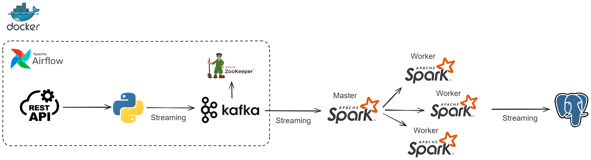

[](LICENSE)

# Usuarios Streaming

Este proyecto trata de obtener datos de usuarios en streaming para despues procesarlos y almacenarlos en una base de datos. 

## Tabla de Contenidos
- [Funcionalidades Principales](#funcionalidades-principales)
- [Diagrama del proyecto](#diagrama-del-proyecto)
- [Instrucciones de Uso](#instrucciones-de-uso)
  - [Prerequisitos](#prerequisitos)
  - [Instalación](#instalación)
  - [Tests](#tests)
- [Tecnologías Utilizadas](#tecnologias-utilizadas)
- [Licencia](#licencia)
- [Contacto](#contacto)

## Funcionalidades Principales

- **Generacion de usuarios:** Permite generar usuarios en streaming de manera constante mediante Kafka. 

- **Procesamiento y almacenamiento de datos:** Permite procesar los datos de los usuarios en real time con Spark y almacenarlos para conservar su informacion en Postgres.

## Diagrama del proyecto



## Instrucciones de Uso

### Prerequisitos

Antes de comenzar, asegúrate de tener instalado Docker en tu máquina. Puedes descargarlo [aquí](https://www.docker.com/get-started).

### Instalación

Para ejecutar la aplicación con Docker:

1. Clona este repositorio con el siguiente comando:

    ```bash
    git clone https://github.com/nachodorado98/Usuarios-Kafka-Spark.git
    ```

2. Navega al directorio del proyecto.

3. Ejecuta el siguiente comando para construir y levantar los contenedores:

    ```bash
    docker-compose up -d
    ```

4. **DAG STREAM DATA**
Inicia el DAG Equipos en la interfaz de Apache Airflow para generar los usuarios en streaming con Kafka: `http://localhost:8080`.

Este DAG genera durante un minuto los usuarios simulando un sistema de registro de usuraios. Esta planificado para ejecutarse de manera diaria pero se puede modificar e incluso ejeuctar de manera manual.

5. Dentro del contenedor del servicio `spark-master`, cambia al directorio del script para ejecutar la aplicacion de Spark:

    ```bash
    cd /opt/spark/nacho/scripts
    ```

6. Ejecuta el siguiente comando para ejecutar la aplicacion en streaming de Spark:

    ```bash
    spark-submit --packages "org.postgresql:postgresql:42.2.23,org.apache.spark:spark-sql-kafka-0-10_2.12:3.3.0" ./spark_script.py
    ```

### Tests

Para ejecutar los tests de la generacion de usuarios con Kafka:

1. Asegúrate de que los contenedores estén en funcionamiento. Si aún no has iniciado los contenedores, utiliza el siguiente comando:

    ```bash
    docker-compose up -d
    ```

2. Dentro del contenedor del servicio `scheduler`, cambia al directorio de los tests:

    ```bash
    cd dags/python/tests
    ```

3. Ejecuta el siguiente comando para ejecutar los tests utilizando pytest:

    ```bash
    pytest
    ```

Este comando ejecutará todas las pruebas en el directorio `tests` y mostrará los resultados en la consola.

## Tecnologías Utilizadas

- [](https://www.python.org/)
- [](https://airflow.apache.org/)
- [](https://spark.apache.org/)
- [](https://kafka.apache.org/)
- [](https://www.postgresql.org/)
- [](https://www.docker.com/)


## Licencia

Este proyecto está bajo la licencia MIT. Para mas informacion ver `LICENSE.txt`.
## 🔗 Contacto
[](https://github.com/nachodorado98/Usuarios-Kafka-Spark.git)

[](mailto:natxo98@gmail.com)

[](https://www.linkedin.com/in/nacho-dorado-ruiz-339209237/)
